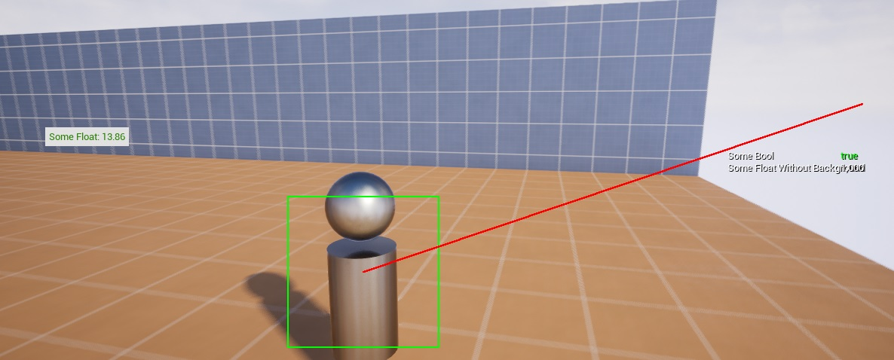

## Usage
Open console and type `Aaron.DebugHud` to enable drawing of the debug hud ***this will persist between PIE sessions***

Open console and type `Aaron.ToggleWorldBoxes` to draw blue boxes around Actors with `DebugBox` tag.

## Credits
All credits go to [Rob Baker's: Pro Unreal Engine Game Coding](https://www.udemy.com/course/pro-unreal-engine-game-coding/)

The implementation is based on the `AAbilitySystemDebugHUD`

